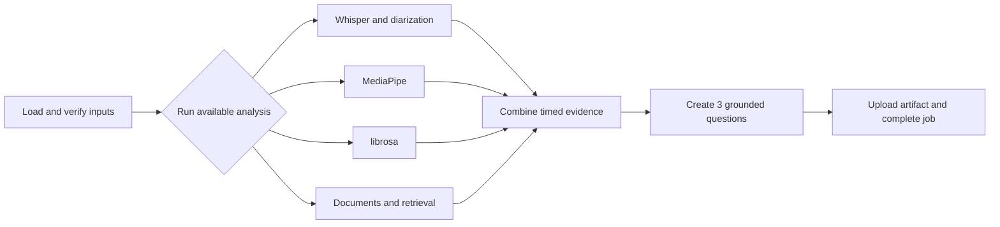

# AI/ML architecture

## Decision

The AI/ML repo runs one worker with one deep pipeline interface. The pipeline can use internal stages, but the backend does not see or coordinate those stages.

```text
ai-ml/
├── pyproject.toml
├── app/
│   ├── worker.py                 # receives and completes AI jobs
│   ├── pipeline.py               # deep PitchAnalysisPipeline interface
│   ├── contracts.py              # job and artifact models
│   ├── stages/
│   │   ├── media.py
│   │   ├── speech.py
│   │   ├── vision.py
│   │   ├── audio.py
│   │   ├── documents.py
│   │   ├── questions.py
│   │   └── reporting.py
│   ├── providers/
│   │   ├── speech.py
│   │   ├── diarization.py
│   │   ├── judge_model.py
│   │   └── embeddings.py
│   ├── persistence.py
│   └── storage.py
├── migrations/                  # ai_* tables only
├── evaluations/
└── tests/
```

No separate orchestrator, aggregator service, document service, model service, or internal HTTP server is needed during the ten-day build.

## Worker interface

The worker understands four job types:

| Job type | Result |
|---|---|
| `analyze_session` | Analysis artifact, three primary questions, speaker labels, limitations |
| `analyze_answer` | Answer transcript, assessment, optional grounded follow-up |
| `generate_report` | Final Evaluation and Report artifacts with team and member feedback |
| `erase_ai_data` | Count and confirmation of removed AI-owned data |

The backend may mark a job cancelled. The worker checks cancellation between expensive stages and before publishing a result.

## Pipeline interface

```python
class PitchAnalysisPipeline(Protocol):
    async def analyze_session(self, job: AnalyzeSessionJob) -> SessionAnalysisResult: ...
    async def analyze_answer(self, job: AnalyzeAnswerJob) -> AnswerAnalysisResult: ...
    async def generate_report(self, job: GenerateReportJob) -> ReportResult: ...
    async def erase_data(self, job: EraseAIDataJob) -> ErasureResult: ...
```

This is the seam used by the worker and end-to-end tests. Speech, vision, document, and model adapters remain internal to the pipeline.

## Analysis flow



Combining evidence is a function inside `pipeline.py`, not a separately deployed aggregator.

## Initial AI choices

- Whisper Large V3 Turbo for transcription and word timestamps.
- pyannote Community-1 for anonymous speaker labels.
- MediaPipe Pose and Face Landmarker for timed posture, movement, and gaze observations.
- librosa for speaking rate, pauses, fillers, and pitch measurements.
- LLM, embeddings, hosting, exact versions, and sampling are selected by the AI team.

Real and fake adapters satisfy the same internal interfaces. Provider request objects do not leak into pipeline results.

## Evidence and scoring

Questions, scores, and findings use the shared contracts in [Data Contracts](../Contracts/Data-Contracts.md). Every material output cites a transcript interval, video/audio interval, document page/slide, or answer interval. Missing evidence stays missing.

The worker reports measurements such as gaze direction, movement, pause length, pitch variation, and speaking rate. It does not infer confidence, anxiety, honesty, emotion, personality, or mental state.

The pre-Q&A `analyze_session` job produces an Analysis Artifact, not the final score. The `generate_report` job combines that artifact with Q&A and produces the final Evaluation, including the 20% Q&A weight, team feedback, and one feedback section for every mapped presenting member.

## Storage and checkpoints

- Raw files and large JSON artifacts stay in object storage.
- Document chunks, embeddings, small derived metadata, and stage checkpoints use `ai_*` PostgreSQL tables.
- A stage checkpoint is reused only when input checksums and relevant model/stage versions match.
- The backend receives object references and validates them before saving user-visible data.

## Failure handling

- Redis may deliver the same job more than once; `job_id` makes processing idempotent.
- Transient stage failures retry up to three times.
- Speech is required. Vision, audio, diarization, and document failures may produce explicit limitations.
- A failed job posts one safe failure update to the backend and remains visible for manual retry.
- A cancelled or superseded job does not publish a usable result.

## Evaluation harness

Keep a small consented benchmark and synthetic fixtures for transcription, diarization, audio metrics, visual coverage, retrieval, grounded questions, report validity, latency, and cost. Deterministic checks run in CI; provider-dependent checks run before changing a model, prompt, embedding, rubric, or sampling policy.
