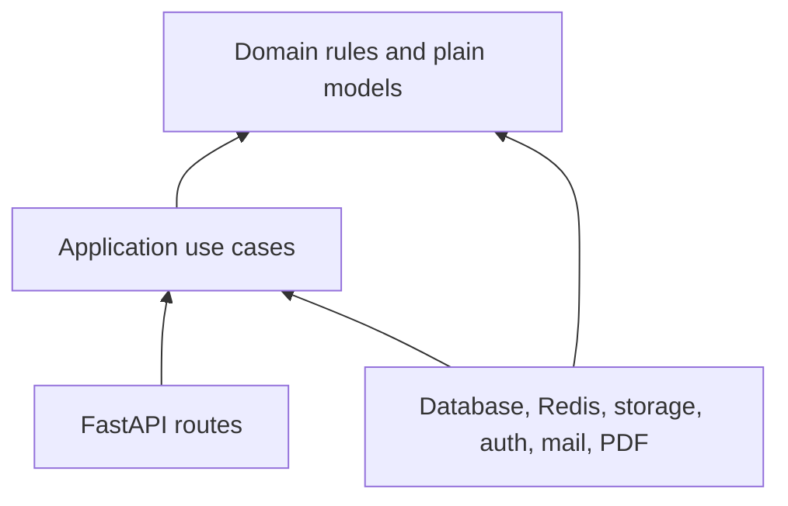
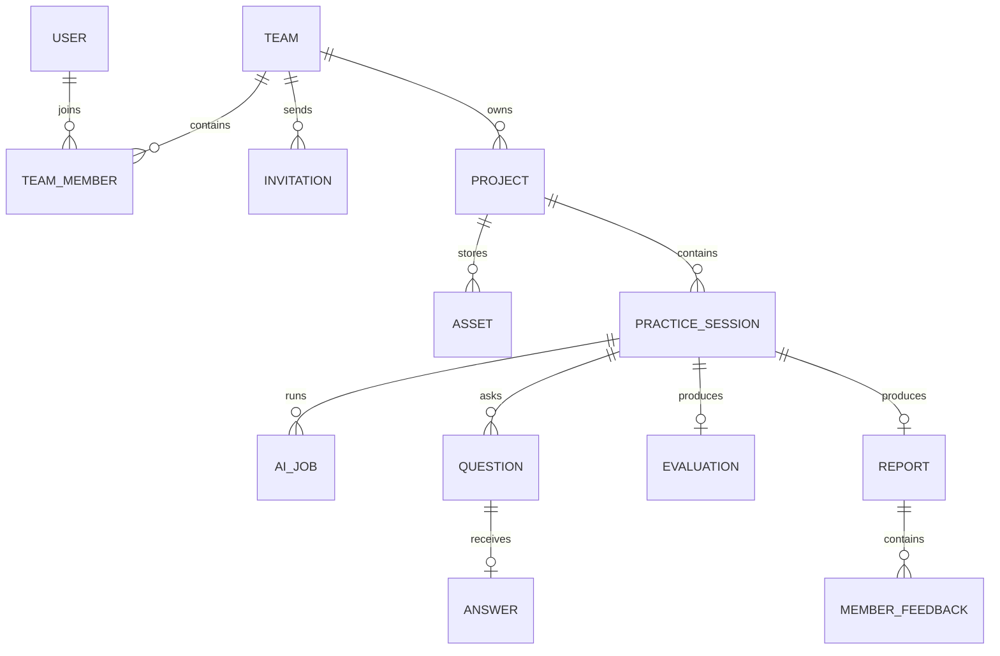

# Backend architecture

## Decision

The backend is one FastAPI application with four layers. It is not split into eight capability modules for the MVP.

```text
backend/
├── pyproject.toml
├── app/
│   ├── api/
│   │   ├── routes/
│   │   │   ├── teams.py
│   │   │   ├── projects.py
│   │   │   ├── assets.py
│   │   │   ├── sessions.py
│   │   │   ├── qa.py
│   │   │   ├── reports.py
│   │   │   └── internal_ai_jobs.py
│   │   ├── dependencies.py
│   │   └── errors.py
│   ├── application/
│   │   ├── teams.py
│   │   ├── projects.py
│   │   ├── sessions.py
│   │   ├── ai_jobs.py
│   │   ├── qa.py
│   │   └── reports.py
│   ├── domain/
│   │   ├── models.py
│   │   ├── session_rules.py
│   │   ├── scoring.py
│   │   └── errors.py
│   ├── infrastructure/
│   │   ├── database.py
│   │   ├── repositories.py
│   │   ├── object_storage.py
│   │   ├── ai_queue.py
│   │   ├── auth.py
│   │   ├── mail.py
│   │   └── pdf.py
│   └── main.py
├── migrations/
└── tests/
```

The files can be split when they become difficult to navigate. The first goal is a clear dependency direction, not a directory for every noun.

## Layer rule



- `domain` contains state rules and calculations with no FastAPI, SQLAlchemy, Redis, or vendor imports.
- `application` runs use cases and depends on small repository/queue/storage interfaces.
- `api` handles HTTP, authentication context, validation, and response mapping.
- `infrastructure` implements database and external integrations.
- `main.py` wires the implementations together.

## Deep modules

Only complexity that callers should not repeat gets a named module and interface.

### SessionWorkflow

`SessionWorkflow` hides manifest freezing, consent, state changes, retries, cancellation, question limits, and report readiness. Routes call its small interface rather than changing session state themselves.

Suggested operations:

- `create_session(...)`
- `start_analysis(session_id, actor, idempotency_key)`
- `submit_answer(question_id, asset_id, actor, idempotency_key)`
- `skip_answer(question_id, actor, idempotency_key)`
- `retry(session_id, actor, idempotency_key)`
- `cancel(session_id, actor, idempotency_key)`

### AIJobs

`AIJobs` hides the `ai_jobs` table, Redis enqueueing, retry dispatch, job-update sequence checks, cancellation, and result validation.

Suggested operations:

- `create(job_type, session_id, attempt, payload)`
- `record_update(job_id, update)`
- `cancel(job_id)`
- `redispatch_pending()`

The route and SessionWorkflow do not need to know how Redis works.

### AssetStore

`AssetStore` creates signed browser URLs, verifies completed uploads, and provides scoped object references to AI jobs. Filename and object-key rules remain inside this module.

The other application files can stay as ordinary use-case functions until repeated complexity earns another interface.

## Core data model



Keep one migration history for backend product tables. AI-owned `ai_*` tables may have their own small migration folder in the AI repo, but both use the same PostgreSQL instance locally and in staging.

## Starting analysis

1. Authorize the member against the Team and Project.
2. Verify consent and uploaded assets.
3. Freeze the exact input manifest.
4. Create the Analysis Attempt and `AIJob` in one database transaction.
5. Ask `AIJobs` to enqueue the job after commit.
6. Return `202 Accepted` immediately.
7. If enqueueing fails, the dispatcher sees the pending row and tries again.

An idempotency key ensures a repeated browser request returns the original attempt and job.

## Receiving AI results

The worker calls one internal endpoint with `started`, `progress`, `completed`, `failed`, or `cancelled` updates.

The backend:

1. authenticates the worker;
2. loads the job by ID;
3. ignores duplicate or older update sequences;
4. checks the job is still current and not cancelled;
5. validates result references, scores, evidence, question count, and member sections;
6. updates the job and product state in one transaction;
7. notifies the browser through the existing session SSE stream.

There is no general event consumer framework in the MVP.

## Invitation email

Invitation creation saves a hashed, expiring, single-use token and then sends mail through Gmail SMTP using a dedicated Gmail or Google Workspace account. Credentials and the from-address come from runtime secrets. A failed send leaves the invitation in `failed` delivery state and the owner can use the resend endpoint.

For the MVP, this send may run as a small FastAPI background task after the invitation is committed. A durable mail queue can be added later if invitation volume or delivery guarantees require it.

## Security and testing

- OIDC tokens are validated by issuer, audience, signature, expiry, and subject.
- Every team-owned record is authorized through Team Membership.
- Upload URLs are short-lived and scoped by object key, method, type, and size.
- Job callbacks require a separate worker credential.
- Domain tests cover session and scoring rules.
- Application tests use in-memory repository, queue, storage, and mail adapters; one allow-listed smoke test verifies live Gmail delivery without exposing credentials or sending during normal CI.
- Integration tests cover PostgreSQL, Redis, object storage, the fake mail adapter, and PDF rendering; the separate allow-listed smoke test covers Gmail SMTP.
- Contract tests validate public OpenAPI and the small AI job callback interface.
