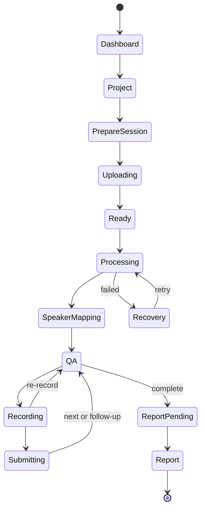

# Frontend architecture

## Responsibilities

The Next.js frontend captures user intent and media, renders server-owned state, and recovers cleanly from browser or network interruption. It does not infer permissions, advance workflow state locally, or call the AI/ML runtime.

## Suggested repository shape

```text
frontend/
├── app/                         # Next.js routes and layouts
├── components/                  # shared visual primitives
├── features/
│   ├── teams/
│   ├── projects/
│   ├── upload/
│   ├── session/
│   ├── qa/
│   └── reports/
├── lib/
│   ├── api/                      # generated client and SSE helper
│   ├── auth/
│   └── media/                    # upload and recording helpers
└── tests/
```

Keep route-specific code near its route and extract a feature only when several screens share its behaviour. Generate request and response types from backend OpenAPI rather than copying interfaces by hand.

## State ownership

| State | Owner |
|---|---|
| Auth token/session | OIDC client integration |
| Team, project, asset, session, Q&A, report | Backend query cache |
| Selected local files and recording draft | Browser feature state |
| Upload progress | Upload task state reconciled with backend Asset state |
| Analysis progress | Backend resource refreshed from SSE notification |
| Current question and submitted answers | Backend Q&A state |

SSE notifications are invalidation hints. On reconnect or a sequence gap, the frontend fetches the current resource instead of trying to rebuild truth from missed events.

## Critical user flow



## Media and upload rules

- Use direct signed uploads; application servers do not proxy large files.
- Calculate checksums in a worker where supported and show determinate progress.
- Record answers only after explicit microphone permission and consent.
- Keep an unsubmitted recording local; remove it after submission or user cancellation.
- Do not auto-play recorded answers or reports.
- Treat browser MIME type as a hint; the backend performs authoritative validation.

## Accessibility and recovery

- Every action is keyboard accessible and has a visible focus state.
- Recording state has text and non-colour indicators.
- Transcript text is available wherever audio evidence is referenced.
- Honour reduced-motion preferences.
- Persist only safe draft identifiers locally; never persist signed URLs or raw media in general application storage.
- If SSE disconnects, reconnect with the last event ID, then refetch the Practice Session.
- Reusing an `Idempotency-Key` prevents double start, answer submission, retry, or deletion.

## Frontend tests

- Component tests for all loading, empty, validation, error, reconnect, and permission states.
- Generated-client contract checks against the reviewed OpenAPI snapshot.
- Browser tests for invitation acceptance, upload, analysis progress, answer re-record/submit/skip, reconnect, report, PDF download, retry, and deletion.
- Axe or equivalent accessibility checks on every critical route.
