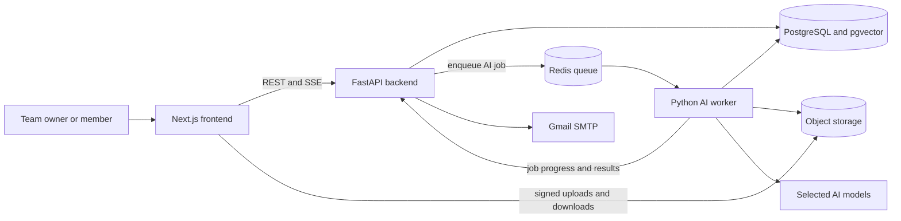
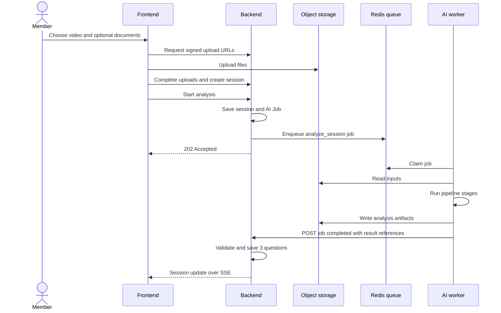
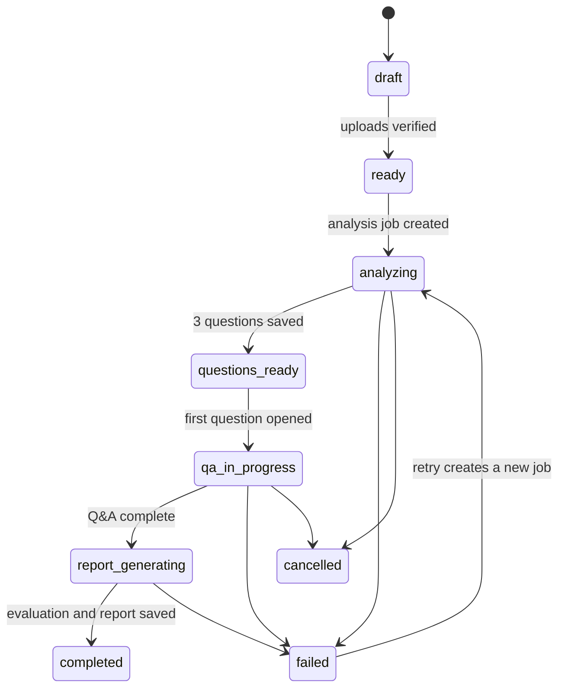

# System architecture

VirtuJudge has three application processes and three supporting services:

- a Next.js frontend;
- a FastAPI backend;
- a Python AI worker;
- PostgreSQL with pgvector;
- S3-compatible object storage;
- Redis as the AI job queue.

The backend also sends invitation email through Gmail SMTP. There is no separate mail worker, event bus, workflow engine, API gateway, or microservice mesh in the MVP.

This is the whole runtime architecture for the ten-day build. The frontend never calls AI directly. The backend owns users, teams, projects, sessions, questions, answers, scores, and reports. The AI worker owns processing code and writes only its derived tables and object-storage prefix.

## Responsibilities

| Part | Responsibility |
|---|---|
| Frontend | Sign-in flow, uploads, recording, status UI, Q&A, report display |
| Backend | Authorization, product data, session state, AI job creation, result validation, email, PDF export |
| AI worker | Speech, diarization, vision, audio metrics, documents, questions, answer analysis, report generation |
| PostgreSQL | Product tables, AI job status, document chunks, embeddings, derived metadata |
| Object storage | Videos, documents, answer audio, AI artifacts, exported PDFs |
| Redis | Pending and running AI jobs; no business truth |

## Main flow

Q&A uses the same pattern. Submitting an answer creates an `analyze_answer` job. Finishing Q&A creates a `generate_report` job. Deletion creates an `erase_ai_data` job.

## Practice Session state

The UI can show stage progress inside `analyzing`, but those stages do not become extra product states.

## Data ownership

One PostgreSQL instance is enough for the MVP:

- the backend owns normal product tables;
- the AI worker owns tables prefixed or schematized as `ai_*` for chunks, embeddings, derived metadata, and checkpoints;
- both use separate database users where the deployment supports it;
- neither writes the other's tables.

One object-storage bucket is also enough. Prefixes and permissions separate user uploads, AI-derived artifacts, and generated reports.

## Reliability without a platform project

- The backend saves an `ai_jobs` row before enqueueing it.
- A small dispatcher retries jobs that were saved but not queued after a crash.
- Every job has one stable `job_id`; the AI worker treats repeats as the same work.
- The worker retries transient stage failures up to three times.
- The backend accepts job updates only when their sequence is newer and the job is still current.
- Failed jobs stay visible in PostgreSQL and can be retried from the product or operator view.
- The backend remains the source of truth even when Redis is restarted.

This gives the MVP recoverability without building a general event platform.

## Deployment

### Local

Docker Compose starts the frontend, backend, AI worker, PostgreSQL/pgvector, Redis, and S3-compatible storage. Gmail is external and enabled with local secrets; automated tests use a fake mail adapter. Fake AI adapters produce a known result without paid credentials.

### Staging

Deploy the same three application processes with managed PostgreSQL, Redis, private object storage, Supabase Auth, a dedicated Gmail or Google Workspace sender, and the AI team's selected providers.

### Later

Separate queues, worker pools, databases, or backend modules only when measurement or team ownership justifies them. Autoscaling, multi-region deployment, billing, disaster recovery, and formal SLOs remain future work.

## Rules worth keeping

- All timestamps are UTC RFC 3339 at interfaces.
- Public IDs are ULIDs.
- Media uses short-lived signed browser URLs.
- AI jobs and result updates use versioned JSON.
- Every score, question, and finding links to evidence or a limitation.
- Model and prompt versions are recorded with each result.
- Private media, document text, transcripts, tokens, and signed URLs never enter logs.
- Customer content is never used to train models.
