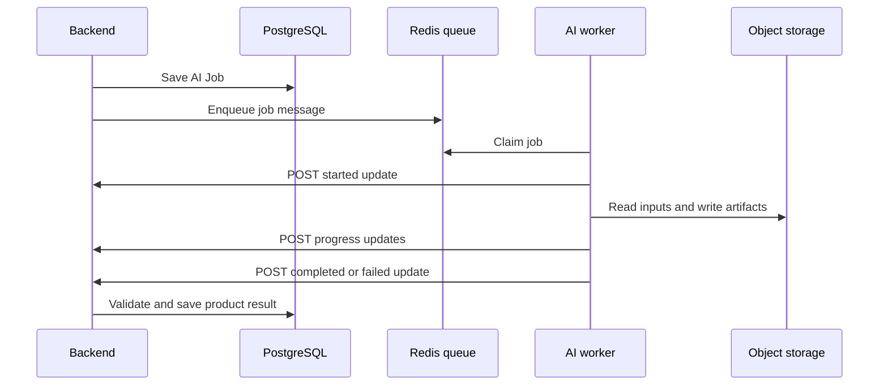

# Backend/AI contract

## Why this contract is small

The backend creates AI Jobs and puts them on a Redis queue. The AI worker processes a job and reports status through one internal backend endpoint. The two repos share versioned JSON schemas, but they do not need a bidirectional event platform.



## Queue message

Redis carries one message shape:

```json
{
  "schema_version": 1,
  "job_id": "01J...",
  "job_type": "analyze_session",
  "practice_session_id": "01J...",
  "analysis_attempt": 1,
  "created_at": "2026-09-02T12:30:00Z",
  "trace_id": "01J...",
  "payload": {}
}
```

`job_type` is one of:

- `analyze_session`
- `analyze_answer`
- `generate_report`
- `erase_ai_data`

The worker validates the schema before starting. Repeated delivery with the same `job_id` resumes or returns the existing outcome rather than repeating completed work.

## Job payloads

### `analyze_session`

```json
{
  "presentation": {
    "artifact_id": "01J...",
    "object_key": "uploads/team/project/video",
    "checksum": "sha256:...",
    "media_type": "video/mp4"
  },
  "supporting_documents": [],
  "rubric": {"rubric_id": "startup_pitch", "version": 1},
  "requested_capabilities": ["speech", "diarization", "vision", "audio", "documents", "questions"]
}
```

### `analyze_answer`

```json
{
  "qa_round_id": "01J...",
  "question_id": "01J...",
  "answer_id": "01J...",
  "answered_by": "01J...",
  "audio": {
    "artifact_id": "01J...",
    "object_key": "answers/team/session/audio",
    "checksum": "sha256:...",
    "media_type": "audio/webm",
    "duration_ms": 84000
  },
  "remaining_follow_ups": 2
}
```

### `generate_report`

```json
{
  "report_id": "01J...",
  "analysis_artifact": {
    "artifact_id": "01J...",
    "object_key": "ai/session/analysis.json",
    "checksum": "sha256:..."
  },
  "qa_artifact": {
    "artifact_id": "01J...",
    "object_key": "ai/session/qa.json",
    "checksum": "sha256:..."
  },
  "speaker_mappings": [
    {"speaker_label": "SPEAKER_00", "user_id": "01J...", "display_name": "Member name"}
  ]
}
```

The report result must include team feedback and one feedback section for every supplied mapping.

### `erase_ai_data`

```json
{
  "erasure_request_id": "01J...",
  "scope": "practice_session",
  "scope_id": "01J..."
}
```

## Worker update endpoint

`POST /internal/v1/ai-jobs/{job_id}/updates`

Authentication: a backend-issued worker credential. It is separate from user JWTs.

Every update uses:

```json
{
  "schema_version": 1,
  "sequence": 3,
  "status": "progress",
  "occurred_at": "2026-09-02T12:30:20Z",
  "trace_id": "01J...",
  "payload": {}
}
```

`status` is `started`, `progress`, `completed`, `failed`, or `cancelled`. Sequence numbers increase within one job. Duplicate or older sequences return `200` with the current job state and do not repeat side effects.

### Started payload

```json
{
  "pipeline_version": "0.1.0"
}
```

### Progress payload

```json
{
  "stage": "speech",
  "progress": 0.45,
  "message": "Transcribing presentation"
}
```

Progress is safe display metadata. It contains no transcript, document text, object key, prompt, or provider error.

### Completed `analyze_session` payload

```json
{
  "analysis_artifact": {
    "artifact_id": "01J...",
    "object_key": "ai/session/analysis.json",
    "checksum": "sha256:...",
    "schema_version": 1
  },
  "primary_questions": [
    {
      "candidate_id": "q-1",
      "text": "What evidence supports the claimed conversion rate?",
      "reason": "The pitch states a rate without a source.",
      "rubric_dimension": "pitch_content_and_evidence",
      "evidence_ids": ["ev_01J..."]
    },
    {
      "candidate_id": "q-2",
      "text": "Which technical assumption is most likely to delay the first release?",
      "reason": "The delivery plan names dependencies but does not rank their risk.",
      "rubric_dimension": "technical_feasibility",
      "evidence_ids": ["ev_01K..."]
    },
    {
      "candidate_id": "q-3",
      "text": "How was the target customer segment validated?",
      "reason": "The pitch defines a segment without presenting validation evidence.",
      "rubric_dimension": "business_reasoning",
      "evidence_ids": ["ev_01M..."]
    }
  ],
  "speaker_labels": ["SPEAKER_00", "SPEAKER_01"],
  "limitations": []
}
```

Exactly three primary questions are required.

### Completed `analyze_answer` payload

```json
{
  "answer_id": "01J...",
  "transcript_artifact_id": "01J...",
  "assessment_artifact_id": "01J...",
  "follow_up": {
    "text": "How would that assumption change if acquisition cost doubled?",
    "reason": "The answer depends on an unstated acquisition-cost assumption.",
    "rubric_dimension": "business_reasoning",
    "evidence_ids": ["ev_01J..."]
  }
}
```

`follow_up` may be absent when the question limit is reached or there is no grounded reason to ask one.

### Completed `generate_report` payload

```json
{
  "evaluation_artifact": {
    "artifact_id": "01J...",
    "object_key": "ai/session/evaluation.json",
    "checksum": "sha256:...",
    "schema_version": 1
  },
  "report_artifact": {
    "artifact_id": "01J...",
    "object_key": "ai/session/report.json",
    "checksum": "sha256:...",
    "schema_version": 1
  },
  "member_feedback_user_ids": ["01J...", "01K..."],
  "limitations": []
}
```

### Completed `erase_ai_data` payload

```json
{
  "erasure_request_id": "01J...",
  "deleted_records": 14,
  "deleted_objects": 6
}
```

### Failed payload

```json
{
  "stage": "speech",
  "code": "provider_timeout",
  "retryable": true,
  "attempts": 3,
  "message": "Speech analysis did not finish before the stage deadline."
}
```

Provider bodies and stack traces stay in restricted AI logs.

## Job status endpoint

`GET /internal/v1/ai-jobs/{job_id}` returns the current job status and a `cancel_requested` flag. The worker checks it between expensive stages. It does not expose team or user data beyond what the worker already received in that job.

## Backend validation

The backend does not trust a completed update just because it came from the worker. It verifies:

- job ID, type, attempt, status, and sequence;
- expected Team, Project, and Practice Session ownership;
- artifact prefix and checksum;
- score ranges and rubric version;
- evidence-reference bounds;
- three primary and at most two follow-up questions;
- team feedback and every mapped member's feedback section;
- cancellation and stale-attempt status.

## Versioning

The queue message and update body each have `schema_version`. Additive optional fields remain compatible within version 1. Removing, renaming, retyping, or changing the meaning of a required field creates version 2. Both repos run the same JSON examples as contract tests.
