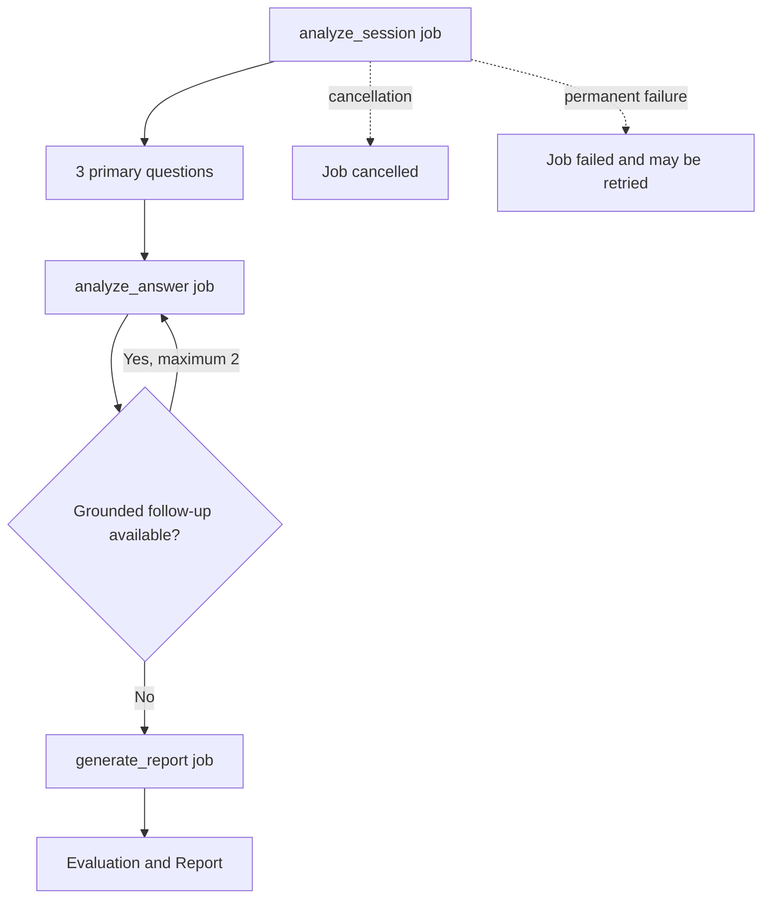

# Job and notification catalogue

The MVP does not use a general event bus. It has four AI job messages, five job-update statuses, five browser notifications, and invitation-delivery status.

## AI jobs

| Job | Created when | Successful result |
|---|---|---|
| `analyze_session` | A member starts or retries a Practice Session | Analysis Artifact, three questions, speaker labels, limitations |
| `analyze_answer` | A member submits answer audio | Transcript, answer assessment, optional follow-up |
| `generate_report` | Q&A finishes | Final Evaluation and Report with team/member feedback |
| `erase_ai_data` | Session/project deletion begins | AI record and object deletion confirmation |

All four use the queue and callback shapes in [Backend/AI Contract](./Backend-AI-Contract.md).

## AI job updates

| Status | Meaning | Backend action |
|---|---|---|
| `started` | Worker accepted the current job | Mark it running and the session active |
| `progress` | One internal stage changed | Save safe display progress and notify browser |
| `completed` | Job produced its typed result | Validate result and advance product state |
| `failed` | Retries were exhausted or failure is permanent | Save safe failure and expose retry where allowed |
| `cancelled` | Worker observed cancellation | Mark the job and attempt cancelled |

Updates are idempotent by `job_id` and increasing `sequence`. The backend ignores older updates and results from cancelled or superseded jobs.

## Browser SSE notifications

Browser notifications contain IDs, version, state, and safe progress only. The frontend refetches the resource for full data.

| Notification | Client action |
|---|---|
| `practice_session.updated.v1` | Refetch the Practice Session |
| `practice_session.analysis_progressed.v1` | Update progress or refetch after a sequence gap |
| `qa.question_available.v1` | Refetch the Q&A Round |
| `report.ready.v1` | Fetch the Report |
| `erasure.updated.v1` | Fetch the Erasure Request |

## Invitation delivery

Invitation delivery is backend-local, not a Redis message:

| Status | Meaning |
|---|---|
| `queued` | Invitation is committed and the background send is scheduled |
| `accepted_by_gmail` | Gmail accepted the message for delivery |
| `failed` | Send failed; owner may call the resend endpoint |

Membership creation still depends on consuming the invitation token, not mail-delivery status.

## Complete asynchronous flow

## Later, if needed

A durable event platform should be considered only when job volume or more consumers make the simple AI Jobs interface insufficient. The versioned job contracts can be carried into that design.
