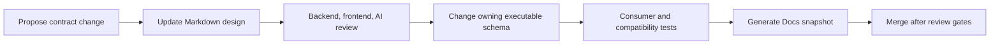

# Contract index and rules

## Contract surfaces

| Surface | Format | Owner | Consumer |
|---|---|---|---|
| Frontend REST API | OpenAPI 3.1 | Backend | Frontend and third-party clients |
| Frontend updates | SSE schema | Backend | Frontend |
| Backend/AI jobs | JSON Schema | Backend | AI worker |
| AI job updates | Internal OpenAPI plus JSON Schema | Backend | AI worker |
| Stored artifacts | Versioned JSON Schema | Producing service | Owning service and explicit consumers |
| Gmail mail adapter | Application port plus integration tests | Backend | Gmail SMTP adapter |

The Markdown in this directory is the reviewable design. Once repositories exist, executable OpenAPI and JSON Schema files live with the code that owns each interface. CI generates snapshots for Docs and fails when implementation and reviewed contracts diverge.

## Shared conventions

- JSON property names use `snake_case`.
- IDs are ULID strings with semantic aliases such as `TeamId` or `PracticeSessionId`.
- Boundary timestamps are UTC RFC 3339 strings.
- Durations and timeline offsets use integer milliseconds.
- Normalized scores use decimal numbers from `0.0` through `1.0`.
- Optional means the property may be absent; nullable means it may be present as `null`. Contracts avoid nullable fields unless `null` carries meaning.
- Unknown enum values are breaking unless an explicit `unknown` value or tolerant-reader rule is defined.
- Money uses integer minor units and ISO 4217 currency when introduced; floats are forbidden.
- Checksums use lowercase `sha256:<hex>`.
- Media and large artifacts travel through object references, not inline base64.
- Breaking changes require a new API or schema major version.

## Compatibility workflow



Additive fields are allowed within `v1` when consumers ignore unknown fields. Removing a field, changing meaning/type, tightening accepted input, renaming a job or update field, or changing an enum requires a new version and a migration period.

## Common headers

| Header | Direction | Required | Meaning |
|---|---|---:|---|
| `Authorization: Bearer <JWT>` | Request | Yes except public health/invitation landing | OIDC access token |
| `X-Correlation-Id` | Both | Client optional, response required | End-to-end trace identifier; backend generates if absent |
| `Idempotency-Key` | Mutating command | As specified | Opaque 16–128 character user-command key |
| `If-Match` | Update/delete | When resource supplies ETag | Optimistic concurrency guard |
| `ETag` | Response | Mutable resources | Resource version token |

## Error contract

Errors use `application/problem+json` and RFC 9457 semantics:

```json
{
  "type": "https://docs.virtujudge.org/problems/session-state-conflict",
  "title": "The practice session cannot accept this operation",
  "status": 409,
  "detail": "Analysis can only start when the session is ready.",
  "instance": "/api/v1/practice-sessions/01J.../analysis-attempts",
  "code": "session_state_conflict",
  "trace_id": "01J...",
  "errors": [
    {"field": "state", "reason": "expected_ready", "actual": "analyzing"}
  ]
}
```

`detail` is safe for users. Internal exceptions, provider bodies, object keys, signed URLs, prompts, and document/media content are never exposed.
