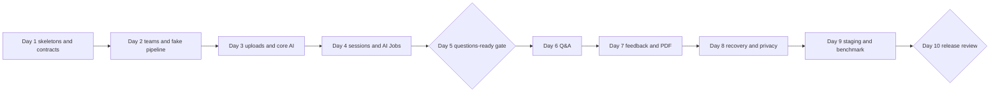

# Ten-day delivery plan

## Assumptions

- Dates: 3–12 September 2026.
- Six people work in parallel: two backend developers, two AI/ML developers, and two frontend developers.
- The MVP has one frontend, one backend, one AI worker, and one shared local/staging infrastructure stack.
- Fake AI results unblock the product flow before every real model is integrated.
- No push or PR happens before the relevant local review.

## Team lanes

| Lane | Primary responsibility |
|---|---|
| Backend 1 | Identity, teams, invitations, session rules, Q&A APIs, retention, and erasure |
| Backend 2 | Local infrastructure, CI integration, assets, AI Jobs, SSE, reports, PDF, and staging support |
| AI 1 | Pipeline contracts, speech, diarization, question generation, answer analysis, and worker recovery |
| AI 2 | Vision, audio metrics, document retrieval, final evaluation, AI quality benchmark, and release benchmark |
| Frontend 1 | Application shell, access journey, session flow, Q&A, accessibility, and browser tests |
| Frontend 2 | Repository bootstrap coordination, asset uploads, speaker mapping, reports, deletion UI, and seeded full-flow fixture |

Each task has one primary owner. The matching teammate reviews it and can help when blocked. Contract changes still require review from the consuming track.

| Person | Primary task IDs | Count |
|---|---|---:|
| Backend 1 | SET-02, BE-01, BE-02, BE-04, BE-07, BE-09 | 6 |
| Backend 2 | SET-05, BE-03, BE-05, BE-06, BE-08, QA-01 | 6 |
| AI 1 | SET-03, AI-01, AI-02, AI-05, AI-06, AI-08 | 6 |
| AI 2 | AI-03, AI-04, AI-07, QA-03, QA-05 | 5 |
| Frontend 1 | SET-04, FE-01, FE-03, FE-05, QA-04 | 5 |
| Frontend 2 | SET-01, FE-02, FE-04, FE-06, QA-02 | 5 |

QA-06 is shared by all six people. Task counts are close, but workload should be judged by acceptance criteria and integration risk rather than count alone.

## Critical path

## The 34 tasks

### Setup

| ID | Task | Owner | Depends on | Done when |
|---|---|---|---|---|
| SET-01 | Create the three code repos with Apache-2.0, basic governance, protected `main`, and CI skeletons | Frontend 2 | None | Repos build a placeholder and contain no secrets |
| SET-02 | Scaffold the four-layer FastAPI backend | Backend 1 | None | Health endpoint, lint, types, and tests pass |
| SET-03 | Scaffold the single Python AI worker and fake pipeline | AI 1 | None | One fake job returns a valid result |
| SET-04 | Scaffold the Next.js frontend and test harness | Frontend 1 | None | App shell and browser test run |
| SET-05 | Create Docker Compose for frontend, backend, AI worker, PostgreSQL/pgvector, Redis, and object storage; document Gmail secrets separately | Backend 2 | SET-02, SET-03, SET-04 | One command starts a healthy local stack without storing mail credentials |

### Backend

| ID | Task | Owner | Depends on | Done when |
|---|---|---|---|---|
| BE-01 | Implement OIDC auth, Users, Teams, members, Projects, and authorization | Backend 1 | SET-02 | Owner/member/cross-team tests pass |
| BE-02 | Implement invitation tokens, Gmail SMTP send, accept, revoke, resend, and delivery status | Backend 1 | BE-01, SET-05 | Gmail delivers an invite and acceptance creates one membership |
| BE-03 | Implement Assets, signed uploads, checksum/type/size/duration validation, and document versioning | Backend 2 | BE-01, SET-05 | MP4/WebM/PDF/PPTX happy and rejection cases pass |
| BE-04 | Implement `SessionWorkflow`: immutable manifest, consent, state rules, attempts, cancel, and retry | Backend 1 | BE-03 | Allowed and forbidden state changes pass |
| BE-05 | Implement `AIJobs`: `ai_jobs` table, Celery/Redis enqueue, pending dispatcher, callback, sequence, and idempotency | Backend 2 | BE-04, SET-05 | Duplicate jobs/updates have one outcome; failed enqueue recovers |
| BE-06 | Implement the Practice Session SSE stream | Backend 2 | BE-04, BE-05 | Refresh/reconnect returns canonical state |
| BE-07 | Implement questions, answer upload, submit/skip, three-primary/two-follow-up limits | Backend 1 | BE-05 | Concurrent or repeated submits do not duplicate answers |
| BE-08 | Validate final Evaluation/Report, store team/member feedback, and render PDF | Backend 2 | BE-07 | Bad weights/evidence/member sections are rejected; PDF renders |
| BE-09 | Implement raw-media retention and project/session erasure across product tables, AI job, objects, and cache | Backend 1 | BE-05, BE-08 | Access revokes immediately and test erasure finishes |

### AI/ML

| ID | Task | Owner | Depends on | Done when |
|---|---|---|---|---|
| AI-01 | Define the `PitchAnalysisPipeline`, four job types, result contracts, fake adapters, and worker callback | AI 1 | SET-03 | Contract fixtures run through the fake pipeline |
| AI-02 | Implement media normalization, Whisper STT, and pyannote diarization | AI 1 | AI-01, SET-05 | Transcript and speaker fixtures meet recorded tolerance |
| AI-03 | Implement MediaPipe vision and librosa audio metrics | AI 2 | AI-01, SET-05 | Timed observable metrics pass synthetic checks |
| AI-04 | Implement PDF/PPTX parsing, chunk provenance, selected embeddings, and pgvector retrieval | AI 2 | AI-01, SET-05 | Known questions retrieve the correct page/slide |
| AI-05 | Combine evidence and generate exactly three grounded primary questions | AI 1 | AI-02, AI-03, AI-04 | Every question has valid evidence and rubric dimension |
| AI-06 | Transcribe/assess answers and generate at most two grounded follow-ups | AI 1 | AI-02, AI-05 | No-follow-up and follow-up cases validate |
| AI-07 | Produce the final Evaluation and Report with 20% Q&A, team feedback, and one section per mapped member | AI 2 | AI-06 | Schema, weight, evidence, and member checks pass |
| AI-08 | Add stage retries, checkpoints, cancellation checks, safe failures, and AI-owned erasure | AI 1 | AI-05, AI-06, AI-07 | Restart/retry/cancel/delete scenarios pass |

### Frontend

| ID | Task | Owner | Depends on | Done when |
|---|---|---|---|---|
| FE-01 | Build sign-in, team/project selection, invitation send/accept, and member list | Frontend 1 | SET-04, BE-01, BE-02 | Access journey passes browser tests |
| FE-02 | Build project assets, direct upload, progress, validation, and document-version selection | Frontend 2 | BE-03 | Refresh-safe upload flow works |
| FE-03 | Build session preparation, consent, start, progress, reconnect, cancel, and retry | Frontend 1 | BE-04, BE-06 | Session can reach questions-ready with fake AI |
| FE-04 | Build speaker-label preview and mapping | Frontend 2 | FE-03, AI-02 | Only current labels and team members can map |
| FE-05 | Build accessible recording, re-record, submit, skip, active-question, and follow-up flow | Frontend 1 | BE-07, AI-06 | Q&A resumes without duplicate answers |
| FE-06 | Build report, team feedback, each member's feedback, evidence, limitations, PDF, and deletion UI | Frontend 2 | BE-08, BE-09, AI-07 | Final user journey passes on mobile and desktop |

### Quality and release

| ID | Task | Owner | Depends on | Done when |
|---|---|---|---|---|
| QA-01 | Add domain, layer, OpenAPI, AI-job JSON, and generated-client checks | Backend 2 | SET-01 through SET-04 | Invalid layer/contract fixtures fail CI |
| QA-02 | Create a seeded full-flow fixture using fake AI and a fake mail adapter | Frontend 2 | SET-05, BE-02, BE-05, AI-01 | Local stack creates a known invitation, questions, and report without sending real mail |
| QA-03 | Build the consented AI benchmark for quality, grounding, latency, and cost | AI 2 | AI-02 through AI-07 | Baseline report records environment and limitations |
| QA-04 | Add browser, accessibility, security, cross-team, reconnect, retry, and erasure tests | Frontend 1 | FE-01 through FE-06 | Critical flow and negative cases pass |
| QA-05 | Benchmark the five-minute pitch and coordinate the staging smoke test | AI 2 | QA-03, QA-04 | Actual p50/p95/cost and staging result are recorded |
| QA-06 | Review docs, contracts, code, security, UX, PDF, benchmark, and full diff before push/PR | All six | QA-05 | Written go/no-go decision and owners for accepted gaps |

## Day-by-day work

### Day 1: Thursday, 3 September

- Backend 1: SET-02 and the public OpenAPI skeleton.
- Backend 2: build the initial SET-05 Compose structure.
- AI 1: SET-03 and the fake worker path.
- AI 2: Draft AI result fixtures and the vision/document adapter boundaries for AI-01.
- Frontend 1: SET-04 and the application shell.
- Frontend 2: SET-01, then draft upload/report screens against agreed contract examples.

Exit: every repo builds; one fake job contract is agreed.

### Day 2: Friday, 4 September

- Backend 1: BE-01.
- Backend 2: finish SET-05 and start QA-01.
- AI 1: AI-01.
- AI 2: add contract fixtures for vision, documents, and report results; prepare AI-03 and AI-04.
- Frontend 1: start FE-01 against mocked responses.
- Frontend 2: prepare FE-02 and start the seeded QA-02 fixture harness.

Exit: a user can create a team/project; fake job completes locally.

### Day 3: Saturday, 5 September

- Backend 1: BE-02, including the allow-listed Gmail smoke test.
- Backend 2: BE-03 and storage integration tests.
- AI 1: AI-02.
- AI 2: AI-03.
- Frontend 1: finish FE-01 with invitation acceptance states.
- Frontend 2: FE-02.

Exit: an allow-listed invitation email arrives through Gmail and valid files reach private storage.

### Day 4: Sunday, 6 September

- Backend 1: BE-04.
- Backend 2: BE-05 and continue QA-01.
- AI 1: finish AI-02 and prepare evidence-combination fixtures for AI-05.
- AI 2: AI-04.
- Frontend 1: start FE-03.
- Frontend 2: finish FE-02 and connect its upload states to the real backend.

Exit: starting a session creates one recoverable AI Job and records worker progress.

### Day 5: Monday, 7 September

- Backend 1: start BE-07 and support session-state fixes at the gate.
- Backend 2: BE-06 and analysis-result validation.
- AI 1: AI-05.
- AI 2: finish AI-03 and AI-04, then support the integrated evidence path.
- Frontend 1: finish FE-03.
- Frontend 2: start FE-04 and complete the executable QA-02 fixture.

Gate: upload → start → AI Job → three grounded questions works. Fix this before adding report features.

### Day 6: Tuesday, 8 September

- Backend 1: finish BE-07 and its duplicate-submit tests.
- Backend 2: finish BE-06, callback contract tests, and reconnect support.
- AI 1: AI-06.
- AI 2: prepare AI-07 report fixtures and verify the 20% Q&A calculation.
- Frontend 1: start FE-05.
- Frontend 2: finish FE-04 and support Q&A integration states.

Exit: the team completes three primary questions and up to two follow-ups.

### Day 7: Wednesday, 9 September

- Backend 1: prepare BE-09 erasure paths and support Q&A fixes.
- Backend 2: BE-08 and PDF visual checks.
- AI 1: finish AI-06 and support end-to-end Q&A fixes.
- AI 2: AI-07.
- Frontend 1: finish FE-05, including keyboard and reconnect behaviour.
- Frontend 2: start FE-06.

Exit: team feedback, each mapped member's feedback, evidence, and PDF work end to end.

### Day 8: Thursday, 10 September

- Backend 1: BE-09 and authorization/erasure hardening.
- Backend 2: finish BE-08 and QA-01.
- AI 1: AI-08.
- AI 2: finish AI-07 and run QA-03.
- Frontend 1: QA-04 for browser, accessibility, reconnect, and negative states.
- Frontend 2: finish FE-06 and report/deletion visual checks.

Feature freeze at the end of the day.

### Day 9: Friday, 11 September

- Backend 1: fix security, retention, erasure, and API integration issues.
- Backend 2: support the QA-05 staging deployment and fix infrastructure, queue, callback, and PDF issues.
- AI 1: finish AI-08 and fix worker reliability or Q&A issues.
- AI 2: finish QA-03 and run QA-05 with Backend 2 staging support.
- Frontend 1: finish QA-04 and fix critical browser/accessibility issues.
- Frontend 2: rerun QA-02 and fix uploads, reports, PDF download, and deletion UI.

Exit: a fresh checkout works and staging completes the critical flow.

### Day 10: Saturday, 12 September

All six contributors run QA-06. Each person reviews their teammate's work and at least one cross-track boundary.

1. Execute unit, contract, integration, browser, security, accessibility, AI benchmark, and PDF checks.
2. Complete one two-speaker session with documents and one presentation-only session.
3. Verify email invitation, refresh/reconnect, retry, cancellation, and deletion.
4. Record actual latency, cost, and known limitations.
5. Review the complete local diff before any push or PR.

## If the schedule slips

Cut polish before structure:

1. Keep one real LLM/embedding adapter plus fakes rather than multiple providers.
2. Use a plain but readable PDF template.
3. Defer invitation resend UI while keeping the endpoint.
4. Defer manual merging of multiple speaker labels.
5. Reduce advanced retrieval tuning while keeping document provenance.

Do not cut authorization, consent, evidence links, team/member feedback separation, idempotent AI Jobs, or deletion.
