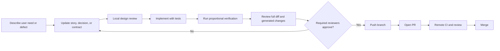

# Review and delivery workflow

No implementation push or PR should happen before the relevant local design, contract, tests, and diff have been reviewed. The purpose is to catch boundary mistakes while they are still cheap, not to create a paperwork stage after code is finished.

## Change path

## Before implementation

1. Identify affected user stories, domain terms, state transitions, contracts, privacy rules, and ADRs.
2. Update the Markdown design and executable schema proposal.
3. Get review from every affected producer and consumer track.
4. Confirm that the change is inside the current scope or rebalance the plan explicitly.
5. Define test and rollback evidence before writing the implementation.

Small internal refactors that don't change behaviour or a boundary do not need a new design document. They still need tests and diff review.

## Required reviewers

| Change | Required local review |
|---|---|
| Frontend/backend REST or SSE | FE and BE |
| Backend/AI Job, update, or artifact | BE and AI |
| Domain language or state machine | BE plus product/documentation owner |
| Model, prompt, rubric, embeddings, sampling | AI plus BE contract reviewer; privacy review when data handling changes |
| Authentication, authorization, retention, erasure | Both backend developers and the affected consumer |
| Docker, staging, secrets, CI | Backend 2 and the affected repository owner |
| User-visible report/PDF | FE, AI, and product/documentation owner |

## Local review checklist

### Scope and behaviour

- The diff solves a referenced user story or documented defect.
- Acceptance criteria and edge cases agree with the implementation.
- Deferred work hasn't leaked into the MVP without a plan change.
- Team and individual feedback remain separate first-class outputs.

### Architecture

- Four-layer dependency direction and the `SessionWorkflow`, `AIJobs`, and pipeline interfaces remain small.
- Backend product state isn't written by AI/ML.
- Large data uses object references rather than queue or callback payloads.
- New vendor/model code is behind a port and records version/provenance.
- A new data store or deployable has measured justification and an ADR where needed.

### Contracts

- Public/internal OpenAPI, AI Job/update JSON Schema, and Markdown agree.
- Examples validate.
- Compatibility checks cover old consumers.
- Idempotency, concurrency, retry, cancellation, and stale-message behaviour are defined.
- Errors are safe and actionable.

### Security and privacy

- Authorization is tested from resource ancestry, not client claims.
- No private content, token, signed URL, or secret enters logs/fixtures.
- Consent and erasure behaviour are preserved.
- Individual observations remain measurable and don't infer human state.

### Verification

- Unit, architecture, contract, and relevant integration/browser tests pass.
- AI/model changes include benchmark comparison.
- UI/PDF changes include accessibility and visual evidence.
- Database migrations have forward/rollback or recovery notes.
- Full diff includes generated files and dependency changes.

## Push and PR gate

Only after local approval:

1. Confirm `git status` contains only intentional files.
2. Review staged and unstaged diffs separately.
3. Check for generated artefact drift and accidental media/secrets.
4. Record the verification commands and results.
5. Push the reviewed branch.
6. Open a PR linking stories, contracts, screenshots/renders, benchmark evidence, migrations, and rollback notes.

The current documentation task stops before steps 5 and 6. Its changes remain local for review.

## Merge gate

- Required remote CI passes.
- Required owners approve.
- No unresolved high-severity security or contract issue remains.
- Contract snapshots were generated, not manually edited.
- The branch is current with its target and migrations have a safe order.
- The PR description records known limitations and deferred follow-up.

## Emergency fixes

An urgent security or availability fix may compress review, but it doesn't skip traceability. Record the reason, smallest safe patch, tests run, reviewer, deployment result, and follow-up documentation immediately after stabilization.
