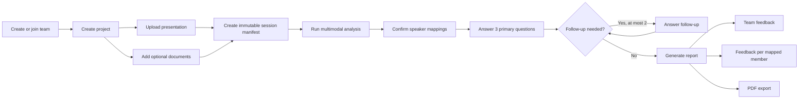

# Product scope

## Outcome

The ten-day MVP must let a team complete one traceable practice loop: prepare project material, upload a presentation, receive grounded questions, submit spoken answers, and read a report containing team feedback and separate feedback for every mapped member.

This is a competition MVP, not the finished commercial platform. The code and contracts still need clear extension points because the project will be open source.

## MVP capabilities

### Access and teams

- Sign in using the configured OIDC-compatible identity provider; Supabase Auth is the first adapter.
- Create a team and manage owner/member roles.
- Invite a member by email through the Gmail mail adapter.
- Accept an expiring, single-use invitation.

### Projects and assets

- Create and manage a Project.
- Upload one MP4 or WebM presentation up to 10 minutes and 500 MB.
- Upload up to five PDF or PPTX supporting documents, up to 25 MB each.
- Validate declared type, file signature, size, checksum, ownership, and upload completion.
- Reuse versioned project documents while keeping each session's input manifest immutable.

### Practice and analysis

- Create, queue, monitor, cancel, and retry a Practice Session.
- Run speech, diarization, vision, and audio-feature analysis in parallel.
- Ground findings and questions in the presentation, documents, or earlier answers.
- Map diarized labels to team members before the final report.
- Allow presentation-only sessions; document-dependent checks become `not_evaluated`.

### Q&A and reports

- Generate three primary questions and up to two adaptive follow-up questions.
- Record, re-record, submit, or explicitly skip an answer.
- Resume Q&A after a refresh or temporary connection loss.
- Generate a report with the agreed rubric, source evidence, limitations, team feedback, and individual member feedback.
- Export the report as PDF.
- Delete a session and schedule its data for erasure.

### Operability

- Run the complete system using Docker Compose.
- Deploy one staging environment.
- Correlate a request from browser through backend, Redis job, AI worker, and report generation.
- Recover from a simulated pipeline failure without duplicating answers, questions, or reports.

## Explicitly deferred

- Live interruption during an answer or presentation
- Streaming transcription
- Judge avatars or personas
- Multilingual analysis
- Billing and subscriptions
- Cross-session progress dashboards
- Email/SMS/push completion notifications
- Public report sharing
- Custom competition rubric authoring UI
- Production autoscaling, multi-region deployment, disaster recovery, and formal uptime commitments

See [Future Work](../Planning/Future-Work.md) for prerequisites and sequencing.

## Product flow

