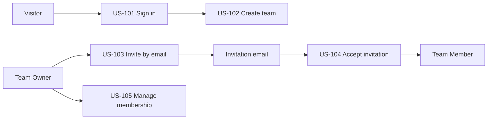

# Access and team user stories

## Story flow

## US-101: Sign in

As a visitor, I want to sign in through the configured identity provider so that I can access my teams without VirtuJudge handling passwords.

Acceptance criteria:

- A valid OIDC token provisions or resolves one local User by issuer and subject.
- Invalid issuer, audience, signature, expiry, or subject returns `401`.
- A signed-in user can fetch `/api/v1/me` and only their teams.
- Redirect targets are allow-listed; tokens do not appear in logs or URLs controlled by VirtuJudge.

## US-102: Create a team

As a signed-in user, I want to create a team so that my projects and sessions have a clear owner.

Acceptance criteria:

- Creating a valid team atomically creates an owner membership for the caller.
- A blank or overlong name is rejected with field-level Problem Details.
- Retrying the same idempotency key doesn't create another team.
- The creator sees the team in their team list immediately.

## US-103: Invite a member by email

As a team owner, I want VirtuJudge to email an invitation so that another presenter can join the team.

Acceptance criteria:

- Only an owner can create, revoke, or resend an invitation.
- The invitation is single-use, expires, is stored as a token hash, and targets one normalized email.
- A background task sends transactional email through Gmail SMTP after the invitation is committed.
- Development and staging use a dedicated Gmail or Google Workspace sender account configured through secrets.
- Automated tests use a fake mail adapter; an allow-listed live smoke test verifies Gmail delivery.
- Delivery failure leaves the invitation valid and exposes a safe resend state.
- Repeated requests with the same idempotency key send at most one logical invitation.

## US-104: Accept an invitation

As an invited user, I want to accept the emailed invitation so that I become a team member.

Acceptance criteria:

- The landing page can show a safe team/inviter preview without exposing team data.
- The signed-in user's normalized email must match the invitation.
- Acceptance consumes the token and creates the membership in one transaction.
- Consumed, revoked, and expired links cannot be reused.
- Concurrent acceptance requests create one membership.

## US-105: Manage membership

As a team owner, I want to view and remove members so that team access stays current.

Acceptance criteria:

- Owners see members, roles, and pending invitation status.
- Members may see the team roster but may not change roles or remove others.
- Removing a membership revokes future access immediately.
- The final owner cannot be removed without transferring ownership or deleting the team.
- Membership and invitation changes produce safe audit records.
