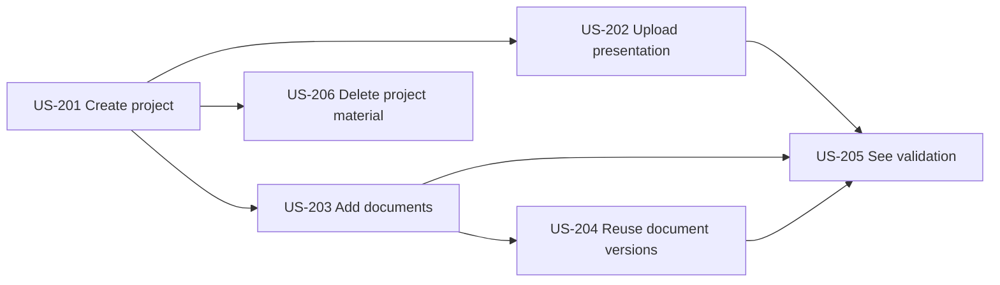

# Project and asset user stories

## Story flow

## US-201: Create a project

As a team member, I want to create a project so that related pitch material and practice sessions stay together.

Acceptance criteria:

- A Project belongs to exactly one Team and records its creator.
- Team members can list and open their team's projects; outsiders receive no existence leak.
- Name and optional description can be edited with optimistic concurrency.
- Project IDs cannot be moved between teams.

## US-202: Upload a presentation

As a team member, I want to upload a pitch video directly to private object storage so that it can be analysed without passing through the API server.

Acceptance criteria:

- The backend creates a short-lived signed upload intent for MP4 or WebM.
- The declared maximum is 500 MB and verified duration is no more than 10 minutes.
- Completion records the observed size and SHA-256 checksum and starts server-side verification.
- A client-supplied name never becomes an object-storage key.
- Failed or abandoned uploads are cleaned up after 24 hours.

## US-203: Add supporting documents

As a team member, I want to add pitch documents so that questions and feedback can be grounded in the project's own claims.

Acceptance criteria:

- PDF and PPTX are accepted up to 25 MB each.
- A session selects at most five supporting-document versions.
- Signature and MIME validation reject a renamed unsupported file.
- Extracted content retains page or slide provenance.
- A project with no documents can still create a valid presentation-only session.

## US-204: Reuse document versions

As a team member, I want to reuse existing project documents so that repeated practice doesn't require another upload.

Acceptance criteria:

- Selecting a document resolves an immutable Asset Version.
- Uploading a replacement creates a new version without changing old Session Manifests.
- The session preview shows the exact versions and checksums that analysis will use.
- A version required by a retained session cannot be silently overwritten.

## US-205: See validation outcomes

As a team member, I want clear upload and validation states so that I can fix rejected input before starting analysis.

Acceptance criteria:

- The UI distinguishes pending upload, uploaded, verifying, verified, rejected, and deleting states.
- A rejection returns a safe code and actionable message without internal parser details.
- Analysis cannot start with an incomplete or rejected presentation.
- Validation updates survive refresh and reconnect.

## US-206: Delete project material

As a team owner, I want to delete unused or sensitive material so that the team controls its data.

Acceptance criteria:

- Deletion requires owner permission and explicit confirmation.
- Access is revoked immediately; an Erasure Request tracks physical removal.
- Deleting a source also removes its AI-derived artifacts and embeddings.
- The erasure workflow completes within 24 hours or alerts an operator.
- Immutable retained sessions either block individual asset deletion or are deleted in the same confirmed scope.
