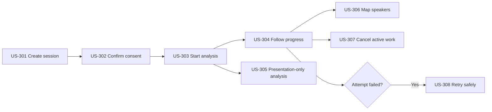

# Practice and analysis user stories

## Story flow

## US-301: Create a Practice Session

As a team member, I want to choose a presentation, documents, and rubric so that one practice attempt has an exact input set.

Acceptance criteria:

- The presentation and document versions belong to the same Project.
- The default startup-pitch rubric version is visible before analysis.
- The draft may change until analysis starts.
- Starting the first Analysis Attempt freezes the Session Manifest permanently.

## US-302: Confirm participant consent

As a session creator, I want to confirm the recording and analysis policy so that participants know how their media and individual feedback will be used.

Acceptance criteria:

- The UI explains transcription, diarization, pose/face landmarks, team feedback, member feedback, providers, and retention.
- The creator must affirm consent for every recorded participant.
- The backend records the policy version, actor, and timestamp.
- Analysis cannot start without accepted current consent.
- Consent revocation cancels work and begins deletion.

## US-303: Start analysis

As a team member, I want to start analysis once so that retries or double-clicks don't create duplicate model work.

Acceptance criteria:

- Only a `ready` session can create its first attempt.
- The attempt and AI Job are saved together before the backend enqueues the job.
- The command requires an idempotency key and returns the same attempt when repeated.
- The API responds without waiting for model execution.

## US-304: Follow processing progress

As a team member, I want to see safe stage progress so that I know whether the session is working or needs action.

Acceptance criteria:

- SSE reports state and stage updates without media or document content.
- Refreshing fetches canonical progress from the backend.
- Out-of-order or duplicate AI progress cannot move a stage backwards.
- Limitations identify skipped or failed optional stages.
- One correlation ID links browser, backend, Redis job, AI worker, and report telemetry.

## US-305: Analyse a presentation without documents

As a team member, I want to practise without supporting documents so that documents are optional rather than a hidden prerequisite.

Acceptance criteria:

- The AI pipeline skips document extraction and retrieval cleanly.
- Document alignment and claim verification are `not_evaluated`.
- Applicable score weights are normalized and shown.
- Questions cite presentation or transcript evidence instead.

## US-306: Map speakers to members

As a team member, I want to confirm which anonymous speaker label belongs to each presenter so that individual feedback is attributed deliberately.

Acceptance criteria:

- The UI provides short, consented preview intervals for each diarized label.
- Only current team members can be selected.
- The backend rejects labels not produced by the current Analysis Attempt.
- Unmapped labels remain anonymous and never receive an invented identity.
- The final report contains a feedback section for every mapped member.

## US-307: Cancel active work

As the session creator or team owner, I want to cancel analysis so that unnecessary processing and cost stop where possible.

Acceptance criteria:

- Cancellation is idempotent and records actor, reason, and timestamp.
- Unstarted stages do not begin after cancellation becomes visible.
- Late results are rejected as stale and don't reopen the session.
- The UI explains that cancellation is best effort for an already-running provider request.

## US-308: Retry a failed attempt

As the session creator or team owner, I want to retry recoverable processing without losing failure history.

Acceptance criteria:

- Three transient retries happen automatically before user action is required.
- A manual retry creates Analysis Attempt N+1 with the same immutable manifest.
- Verified compatible stage artifacts may be reused by checksum and version.
- The failed attempt, safe error, timing, and trace remain accessible.
- Repeating the retry command doesn't create another attempt.
