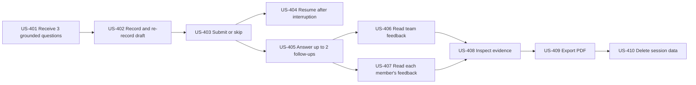

# Q&A and report user stories

## Story flow

## US-401: Receive grounded primary questions

As a team member, I want three questions tied to weaknesses or gaps in our pitch so that practice focuses on useful issues.

Acceptance criteria:

- Exactly three primary questions are created after successful or allowed-partial analysis.
- Every question records a reason, rubric dimension, and one or more valid evidence references.
- Questions may target a contradiction, unsupported claim, omission, document detail, or weak explanation.
- The backend rejects malformed, ungrounded, duplicate, or excessive candidates.

## US-402: Record and re-record an answer

As a team member, I want to review a local recording before submitting it so that a microphone mistake doesn't become permanent evidence.

Acceptance criteria:

- The browser asks for microphone permission and shows recording state without relying on colour alone.
- The member can play, discard, and replace the local draft.
- The draft isn't uploaded until the user chooses to continue.
- Signed upload details and raw audio are not written to application logs or analytics.
- The recommended answer limit is two minutes and is visible before recording.

## US-403: Submit or skip an answer

As a team member, I want to submit a spoken answer or explicitly skip so that the round advances intentionally.

Acceptance criteria:

- Only the active question accepts a submission or skip.
- Submission verifies the audio asset before publishing AI work.
- Submitted and skipped answers are immutable.
- Repeated commands with the same idempotency key create one outcome.
- A skipped answer is shown as skipped, not as an empty or failed answer.
- A voluntary skip contributes zero for that question's Q&A contribution; it is not treated as a system-unavailable `not_evaluated` result.

## US-404: Resume Q&A after interruption

As a team member, I want to resume after a refresh or lost connection so that I don't lose submitted work or create duplicate answers.

Acceptance criteria:

- The backend returns the Q&A Round, active question, and submitted/skipped answers.
- SSE reconnect uses the last event ID and then refetches canonical state.
- A sequence gap never causes the client to guess the next question.
- An unsubmitted local recording may be lost; the UI communicates this before refresh where possible.

## US-405: Answer adaptive follow-ups

As a team member, I want relevant follow-up questions based on earlier answers so that the session behaves like a serious pitch review.

Acceptance criteria:

- The round contains no more than two follow-up questions.
- A follow-up cites the parent answer and other supporting evidence.
- If no grounded follow-up is useful, the backend proceeds to reporting.
- The AI cannot bypass the backend's question-count or ordering invariants.

## US-406: Read team feedback

As a team member, I want feedback for the whole team so that we can improve the pitch as one presentation.

Acceptance criteria:

- The report covers all applicable rubric dimensions and the configured 20% Q&A weight.
- Findings distinguish team-level reasoning/content from individual delivery observations.
- Every scored component has evidence and a clear rationale.
- Missing stages produce limitations and `not_evaluated`, not zero or invented text.

## US-407: Read feedback for every member

As a mapped team member, I want my own complete feedback section so that I know what to improve individually.

Acceptance criteria:

- There is one section for every mapped member, even when the section can only report a limitation.
- Each section includes a summary, evidence-linked strengths, actionable improvements, delivery components, and Q&A feedback when that member answered.
- Members are not ranked against one another.
- Observable delivery measurements are not presented as emotion, confidence, honesty, anxiety, personality, or mental state.

## US-408: Inspect evidence and limitations

As a team member, I want to open the source behind a question or finding so that I can judge whether the feedback is fair.

Acceptance criteria:

- Transcript evidence opens the relevant timestamp and segment.
- Video/audio evidence identifies the exact interval and measured metric/unit.
- Document evidence identifies asset version and page or slide.
- Answer evidence identifies the question, answer, and transcript interval.
- Unsupported model inference is labelled and cannot satisfy a required evidence reference.

## US-409: Export a private PDF

As a team member, I want a PDF copy so that I can review the result away from the dashboard.

Acceptance criteria:

- PDF generation uses the canonical backend Report, not raw model output.
- The PDF includes team feedback and every mapped member's feedback.
- Evidence labels, limitations, rubric version, and generation timestamp remain visible.
- Download uses a short-lived signed URL and team authorization.
- Visual regression or rendered-page review catches clipping and unreadable content.

## US-410: Delete session data

As a team owner, I want to delete a Practice Session so that its media, documents where scoped, derived artifacts, questions, answers, reports, and PDFs are removed.

Acceptance criteria:

- Access is revoked as soon as deletion is accepted.
- Backend, AI database, object storage, Redis/cache, and report artifacts participate in erasure.
- Physical deletion completes within 24 hours or an operator is alerted.
- A safe audit tombstone retains request, scope, actor, timestamps, and outcome without deleted content.
