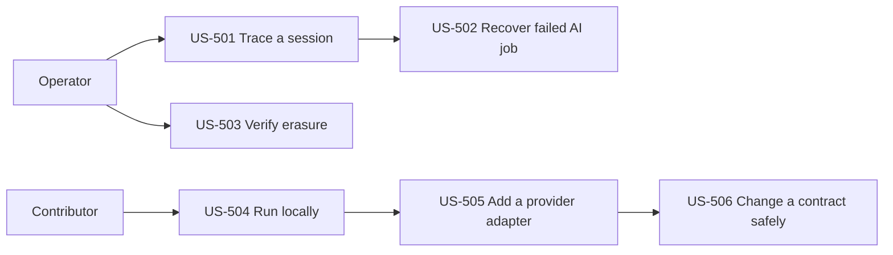

# Operations and open-source user stories

## Story flow

## US-501: Trace a session across services

As an operator, I want one correlation trail so that I can diagnose a slow or failed session without opening private media.

Acceptance criteria:

- API responses, AI Job records, queue messages, worker stages, model calls, and report generation share a trace ID.
- Safe telemetry shows stage duration, retry count, model/provider identifier, cost where available, and outcome.
- Logs never contain document text, transcript text, raw media, bearer tokens, invitation tokens, prompts with user content, or signed URLs.
- Dashboards separate user-facing failure from provider/internal cause.

## US-502: Recover a failed AI Job

As an operator, I want to inspect and retry a failed AI Job safely so that transient failures don't require database edits.

Acceptance criteria:

- The failed-job view shows type, safe failure, attempts, timestamps, and trace ID.
- Retry requires a recorded reason and checks that the session/attempt is still current.
- Retry creates a new job/attempt through the normal application use case.
- Cancelled, erased, or superseded work cannot be forced back into an active session.

## US-503: Verify erasure

As an operator, I want erasure status across every store so that deletion deadlines are measurable.

Acceptance criteria:

- Backend database, AI database, object storage, derived PDFs, cache, and queued work report completion independently.
- A request missing any required confirmation remains incomplete.
- Failed deletion retries and alerts before the 24-hour deadline.
- Verification uses synthetic identifiers and doesn't expose deleted content.

## US-504: Run the project locally

As a contributor, I want one documented setup path so that I can exercise the full flow without paid services.

Acceptance criteria:

- Docker Compose starts frontend, backend, fake/deterministic AI, PostgreSQL, Redis, S3-compatible storage, and local observability; Gmail remains an external service configured through secrets.
- Example configuration contains placeholders only.
- Seeded synthetic fixtures produce a known report and invitation email.
- Health checks and a smoke-test command identify missing dependencies.

## US-505: Add or replace an AI provider

As an AI contributor, I want a stable provider port and evaluation harness so that model choices can change without rewriting the pipeline.

Acceptance criteria:

- Provider request/response types don't leak beyond the adapter.
- Contract tests cover canonical success, timeout, rate limit, malformed output, and cancellation behaviour.
- The adapter declares capability, model/version metadata, data-handling configuration, and cost signals.
- The consented benchmark compares quality, latency, and cost before the adapter becomes a default.

## US-506: Change a contract safely

As a contributor, I want compatibility checks and review gates so that one repository cannot silently break another.

Acceptance criteria:

- The Markdown design changes before or with the executable schema.
- Backend, frontend, and AI reviewers approve affected boundary changes.
- OpenAPI, AI Job JSON Schema, callback, example, and generated-client checks pass.
- Breaking changes create a new version with a documented migration period.
- No automation pushes or opens a PR before the local documentation and code review is complete.
