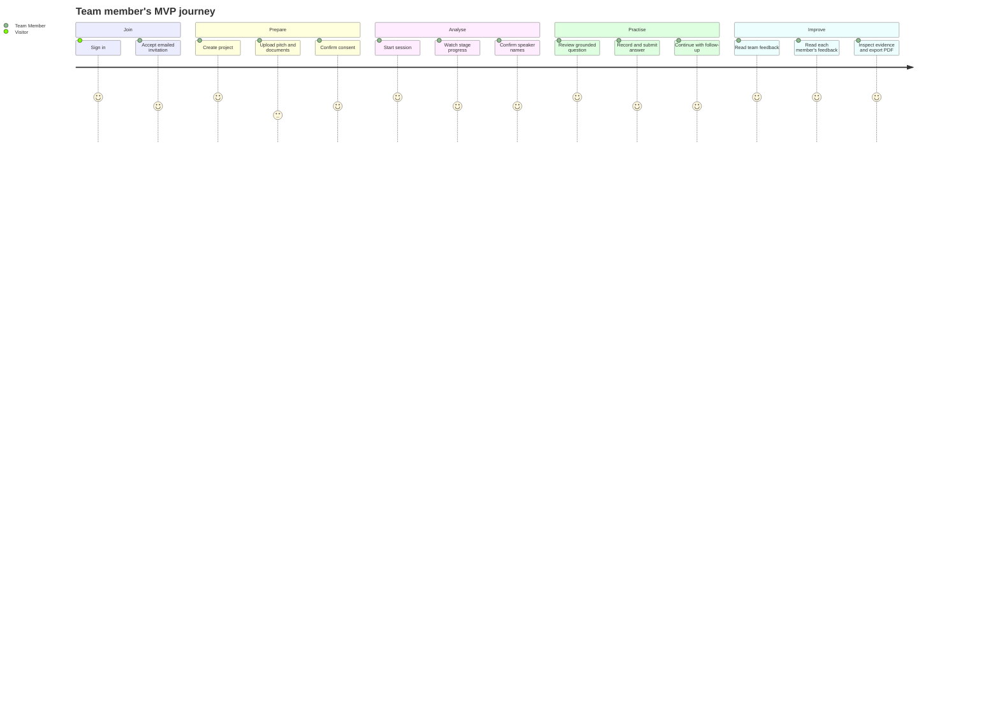

# User-story map

## Personas

- **Visitor**: a person who has not signed in.
- **Team Owner**: a member who manages membership, retention, and destructive operations.
- **Team Member**: a user who prepares and completes practice sessions.
- **Operator**: a trusted maintainer responsible for system health and recovery.
- **Contributor**: an open-source developer extending or verifying the project.

The AI/ML worker and retention worker are system actors in diagrams, not users. They still have explicit acceptance stories because their behaviour crosses service boundaries.

## Story groups

- [Access and teams](./01-Access-and-Teams.md)
- [Projects and assets](./02-Projects-and-Assets.md)
- [Practice and analysis](./03-Practice-and-Analysis.md)
- [Q&A and reports](./04-QA-and-Reports.md)
- [Operations and open source](./05-Operations-and-Open-Source.md)

## Complete MVP story map

```mermaid
flowchart LR
    subgraph Access[Access and teams]
        US101[US-101 Sign in]
        US102[US-102 Create team]
        US103[US-103 Invite by email]
        US104[US-104 Accept invitation]
        US105[US-105 Manage membership]
    end

    subgraph Material[Projects and assets]
        US201[US-201 Create project]
        US202[US-202 Upload presentation]
        US203[US-203 Add documents]
        US204[US-204 Reuse versions]
        US205[US-205 See validation]
        US206[US-206 Delete material]
    end

    subgraph Practice[Practice and analysis]
        US301[US-301 Create session]
        US302[US-302 Give consent]
        US303[US-303 Start analysis]
        US304[US-304 Follow progress]
        US305[US-305 Presentation only]
        US306[US-306 Map speakers]
        US307[US-307 Cancel]
        US308[US-308 Retry]
    end

    subgraph QA[Q&A and reports]
        US401[US-401 Receive questions]
        US402[US-402 Record draft]
        US403[US-403 Submit or skip]
        US404[US-404 Resume Q&A]
        US405[US-405 Answer follow-ups]
        US406[US-406 Team feedback]
        US407[US-407 Member feedback]
        US408[US-408 Inspect evidence]
        US409[US-409 Export PDF]
        US410[US-410 Delete session]
    end

    subgraph Ops[Operations and open source]
        US501[US-501 Trace work]
        US502[US-502 Recover failed job]
        US503[US-503 Verify erasure]
        US504[US-504 Run locally]
        US505[US-505 Add provider]
        US506[US-506 Review contracts]
    end

    US101 --> US102 --> US103 --> US104 --> US105
    US102 --> US201 --> US202 --> US203 --> US204
    US202 --> US205
    US203 --> US205
    US205 --> US301 --> US302 --> US303 --> US304
    US303 --> US305
    US304 --> US306 --> US401 --> US402 --> US403 --> US405
    US403 --> US404
    US405 --> US406 --> US407 --> US408 --> US409 --> US410
    US304 --> US307
    US304 --> US308
    US206 --> US503
    US410 --> US503
    US303 --> US501
    US501 --> US502
    US504 --> US505 --> US506
```

## Journey and release slices

The first vertical slice ends at US-304 using deterministic fake AI. The second reaches US-403. The MVP slice ends at US-410 and includes the operator/contributor gates.

## Acceptance language

`Given/When/Then` scenarios are behavioural examples, not implementation scripts. Authorization, idempotency, accessibility, privacy, and observability requirements apply to every story even when they aren't repeated in every scenario.
